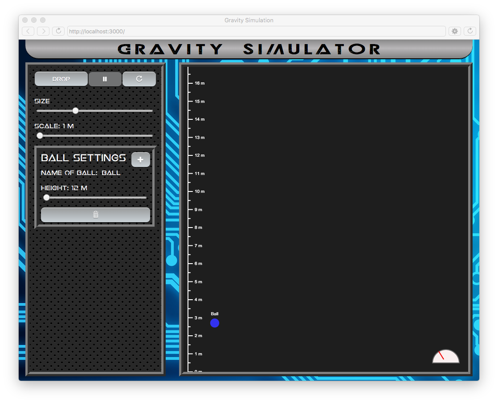
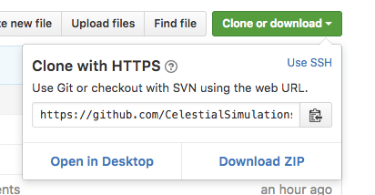

# The Gravity Simulator

Welcome to the Gravity Simulator! This program stimulates gravity by dropping a ball at
the rate of gravity! You are able to add multiple balls, delete them, change the size and scale of the axis, pause and reset the simulation, and change the name and height of a ball.



To explore it, we will first need to [get the the code](#getting-the-code...).

However, I think we might be missing something. Changing the height and name of the balls is fun and all, but we're not seeing any interesting comparision here. Let's change that. We need to add a **new setting**.

In order to add a new setting, we'll need to decide which variable we want to make editable. The complete list of settings we can add are:
* gravity
* elasticity
* radius
* fillColor

To access the values of the selected ball, you can use:

* `ballObjs[index].gravity`
* `ballObjs[index].elasticity`
* `ballObjs[index].radius`
* `ballObjs[index].fillColor`

Adding a new setting will involve several steps, but I have carefully commented the code, so it should be fairly easy to follow if you read them.

The steps are:
1. [Declaring the label and slider variables](#declaring)
2. [Drawing the elements](#drawing)
3. [Displaying the value](#displaying-the-value)
4. [Setting the value of the slider](#defining-slider-value)
5. [Setting the value of the ball](#defining-ball-value)

## Declaring
First, we need to declare two variables for the **label element** and the **slider element**. What is a variable, you may ask? A variable is a stored value with a name. In our program, define a variable like this:

```
var (name) = (some value);
```

name could be anything — but it's best to use mainly alphebtical letters to avoid syntax errors. some value could also be anything — it could be a number, a string (words in quotations), an array (a data-type variable), lot's of things. You also don't have to have one — you can just declare it first to initilize it. In our program, we're just going to have strings and numbers.

Continuing on, let's declare our label and slider variables as:
```
var gravityLabel, gravitySlider;
```

## Drawing
Now let's draw a slider and a label! This is actually quite simple to do, thanks to p5's built in functions `createElement()` and `createSlider()`.

To do this, go to the function, `settingsSetup()`, and write the name of our label variable, which is `gravityLabel` in our case, and have it equal to `createElement('label').parent('ballSettings');`. It should look like this:

```
gravityLabel = createElement('label').parent('ballSettings');
```

Then we need to draw our slider element. Write the name the slider variable and have it equal to `createSlider(min value, max value, starting value, step).id(gravitySlider).parent('ballSettings');`. The createSlider() function will need some parameters in order to make it an effective slider. The first parameter needs to the minimum values you want the slider to be able to have, the second parameter needs to the max value you want the slider to have, the third parameter needs to be the value you want the slider to start at, and the fourth parameter needs to be incremental change of the slider. You do not have to include the fourth slider, it's default is 1. So you could define the slider variable like this:

```
gravitySlider = createSlider(0.5, 200, 10, 0.5).id('gravitySlider').parent('ballSettings');
```

## Displaying the Value
It would help us greatly in analyzing the simulation if we were to know what the current values of the sliders were. To add this feature, first go to the function `settingsDrawLabelValue()`. We will need to select the HTML of the label element and have it equal to the value of the setting. It should look like this:

```
gravityLabel.elt.innerHTML = 'Gravity: ' + ballObjs[index].gravity + ' m/sec/sec';
```

Here, we wrote our label variable, and added .elt.innerHTML to it before we defined it. Why did we do this? So we could access the HTML of our label element, and change the text. We are defining this variable as a string, quotations need to be added around the letters.  `ballObjs[index].gravity` is the gravity of the ball. The strings 'Gravity: ' and ' m/sec/sec' serve as context.

## Defining the Slider Value
We will need the slider value to adjust to the value of ball. When a new ball is added, it takes the values that the sliders are currently at, but if we want to select a different ball, then the values of the sliders need to change to the ball's. First, we need to go to the `settingsSetValue()` function and add a single line that looks like this:

```
document.getElementById('gravitySlider').value = ballObjs[i].gravity;
```

In the function document.getElementById(), the slider variable will need to be our parameter. `document.getElementById('gravitySlider').value` is the value of the slider, and we are setting it equal to `ballObjs[i].gravity`, the value of the gravity of the ball.

## Defining the Ball Value
When the ball is selected, we want to be able to edit the ball's values. We are able to do this with the height in the simulation, and we are trying to achieve this with gravity now. So to do this, we need to go the function, `settingsEdit()`, and define the value of the ball to be equal to the value of the slider. The value of the gravity of the selected ball can be written as `ballObjs[index].gravity` and the value of the slider can be written as `gravitySlider.value()`. So the statement should look like this:

```
ballObjs[index].gravity = gravitySlider.value();
```

##Getting the Code...
To get the code from the online repository to your computer, you can either download it or clone it.

1. [Downloading it](#downloading)
2. [Cloning it](#cloning)

### Downloading

Simply find this button,



and click Download Zip.

### Cloning

If you choose to use git, then you'll first to want to open Terminal. Search Terminal on your computer
and open it. Type:

```
cd Documents
```
and hit enter to navigate to the Documents folder within Terminal (it's just like the Finder). Then you'll want to
type in the following git command. You can just copy and paste the entire block and hit enter. Git will
do the work for you. Believe in Git.

```
git clone https://github.com/CelestialSimulations/Light-Speed-Sim.git
```
It should appear in Documents folder quickly.

You should rename your folder so you know it's yours. Now double click on your folder, and then open the file called **ball-settings.js** in either Atom or the application P5, which should be on your computer. Both are excellent code editors, it doesn't matter a whole lot which one you choose. With Atom, you can run the program by double-clicking on the file called index.html, and with P5, you can just click on the run icon.

Now, to analyze your Gravity Simulator!